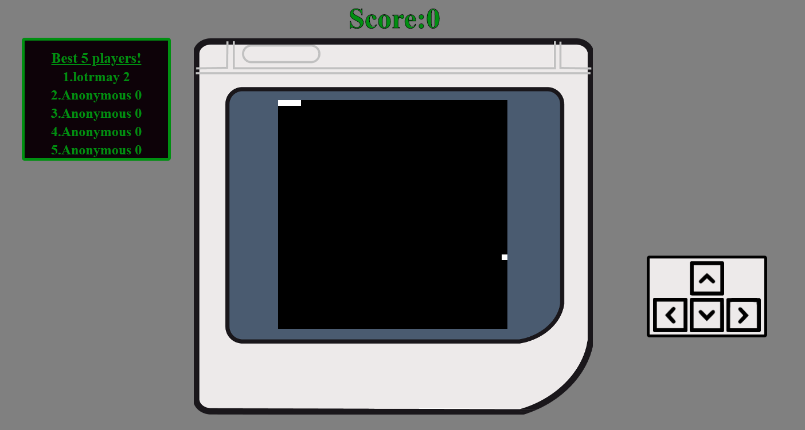

# Snake game
I made a snake game in javascript and then used node.js to connect a scoreboard to it with top 5 players via node.js.
You can control the snake moves by using **arrows**,**WASD** keys or **arrow buttons**. Default database is called: **scoreboard** and has 1 table: **players**. This table has
2 columns: **nick** (*text*) and **score** (*number*). 
This game should look like this when initiated:
